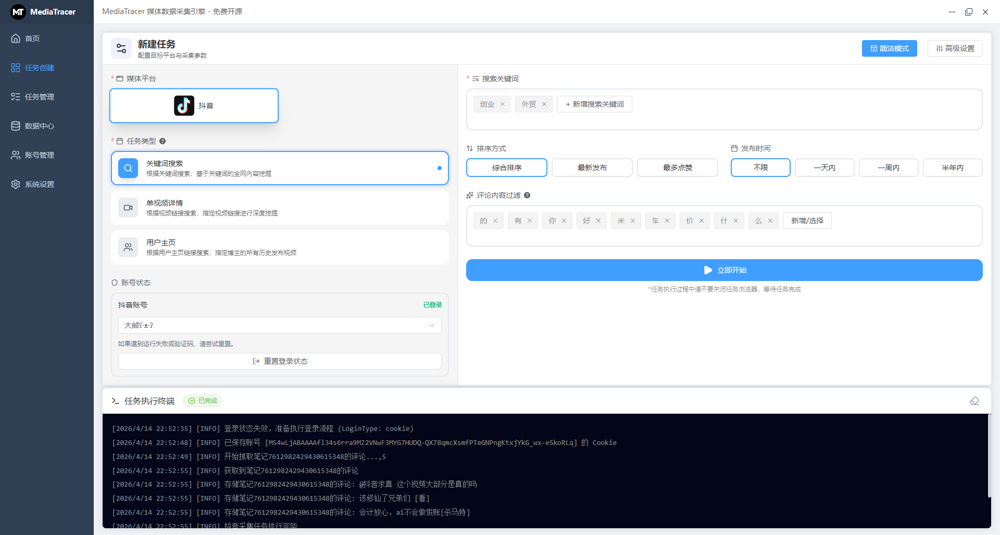
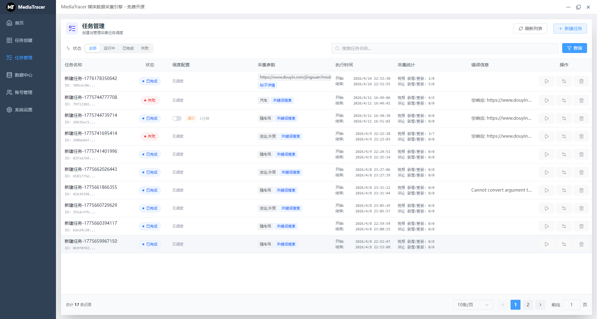
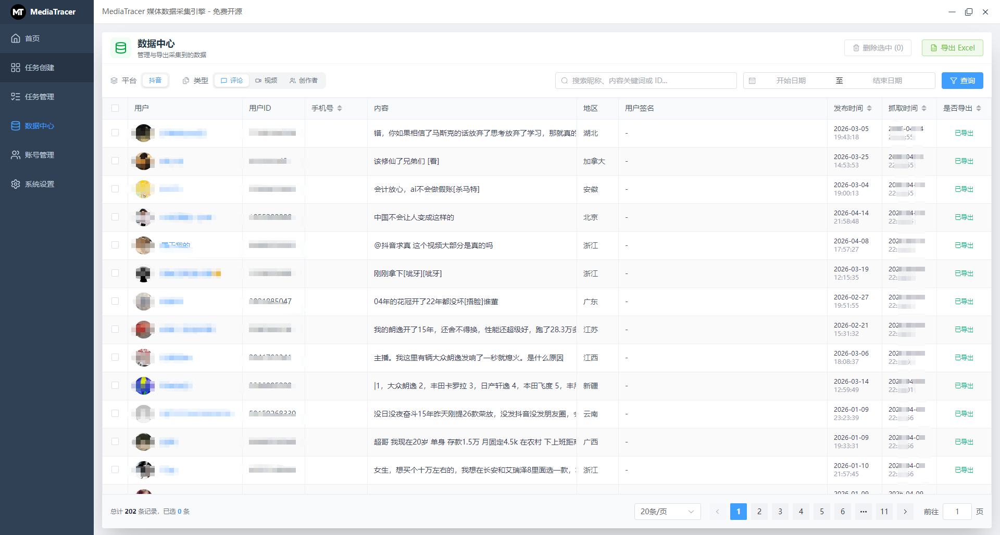
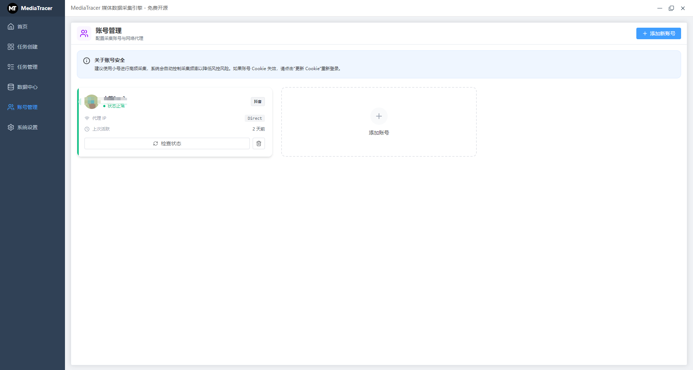
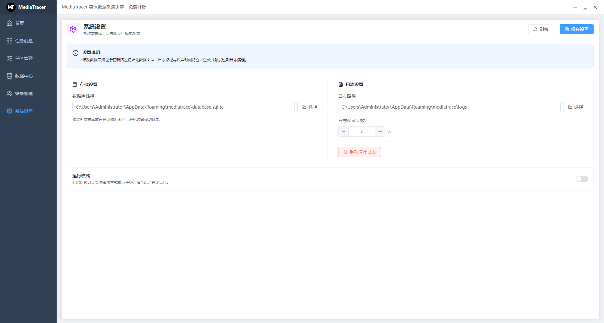

# MediaTracer

English | [简体中文](./README.md)

**MediaTracer** is a modern desktop media data crawling and task scheduling platform based on Electron + Playwright. Through a visual interface, it helps users easily implement data crawling, account management, and automated scheduling for mainstream media platforms (such as Douyin, Xiaohongshu, etc.).


## 🚀 Core Features

- **Multi-mode Crawling**: Supports deep data mining across three dimensions: **Keyword Search**, **Post/Note Details**, and **Creator Homepage**.
- **Task Scheduling**: Built-in powerful task scheduling engine, supporting one-time execution and recurring automated tasks (scheduling) to free your hands.
- **Multi-account Multiplexing**: Unified account and Cookie management, supporting local maintenance of multi-platform login states, greatly reducing the cost of repeated QR code scanning for logins.
- **Data Center**: Structurally displays crawled comments, posts, authors, and other data, supporting conditional combined filtering, batch deletion, and **One-click Export to Excel**.
- **Silent Running**: Driven by Playwright, Headless mode can be configured in system settings to crawl data silently in the background.
- **Data Security**: Uses a local SQLite database to store all core data and configurations, keeping data completely in your own hands.

## 📸 Screenshots

<p align="center">
  
  
</p>
<p align="center">
  
  
</p>
<p align="center">
  
  
</p>

## 🛠️ Tech Stack

This project is built using the latest frontend and desktop technology stacks:
- **Core Framework**: [Electron](https://www.electronjs.org/) + [Vue 3](https://vuejs.org/) (Composition API) + [TypeScript](https://www.typescriptlang.org/)
- **Build Tool**: [Vite](https://vitejs.dev/) + [electron-builder](https://www.electron.build/)
- **Automated Crawling**: [Playwright](https://playwright.dev/)
- **UI Component Library**: [Element Plus](https://element-plus.org/) + [Tailwind CSS](https://tailwindcss.com/) / [Lucide Icons](https://lucide.dev/)
- **Local Storage**: [better-sqlite3](https://github.com/WiseLibs/better-sqlite3)

## 📦 Project Structure

```text
electron-app/
├── electron/                 # Electron main process code
│   ├── main/                 # Core logic (IPC communication, database operations, crawler controllers, etc.)
│   │   ├── platforms/        # Crawler implementations for each platform (e.g., dy)
│   │   ├── runtime/          # Runtime configuration, logging, data management
│   │   └── storage/          # Data storage solutions like SQLite, CSV
│   └── preload/              # Preload scripts (safely expose Node.js API to the renderer process)
├── src/                      # Vue 3 renderer process code
│   ├── assets/               # Static assets and icons
│   ├── components/           # Global common components
│   ├── router/               # Vue Router configuration
│   ├── store/                # Pinia state management
│   └── views/                # Page views (Home, Tasks, Data Center, Accounts, Settings)
├── package.json              # Project dependencies and build scripts
└── vite.config.ts            # Vite and Electron plugin configuration
```

## ⚙️ Quick Start

### 1. Environment Preparation
Please ensure Node.js is installed on your computer (v18+ or v20+ recommended). Since a locally compiled SQLite library is used, if you are on Windows, you may need to install [windows-build-tools](https://github.com/felixrieseberg/windows-build-tools).

### 2. Install Dependencies
Run the following in the `electron-app` directory:
```bash
npm install
```

### 3. Run in Development Environment
Start the local development server and open the Electron app:
```bash
npm run dev
```

### 4. Build for Production
Build and package as an installation package for the Windows platform (`.exe`):
```bash
npm run build
```
The packaged installation file will be generated in the `dist_app/` directory.

## 📖 Usage Guide

1. **Configure Environment**: On first use, please enter the "System Settings" page to confirm the database path, log directory, and configure the crawling browser mode (whether headless mode) as needed.
2. **Account Login**: Enter the "Account Management" page, add the platform accounts you need to crawl, and scan the QR code or enter the Cookie to ensure the account status is "Valid".
3. **Create Task**: Go to "Task Management -> New Crawl Task", select the target platform, enter keywords/links, and start the task after setting the scheduling strategy.
4. **Monitor and Export**: Real-time running logs can be viewed while the task is running. After the task is completed, enter the "Data Center" to view the crawl results and export the required data tables.

## 📄 License
MIT

## ⚠️ Disclaimer

> **Core Purpose: The open-source content of this project is strictly for learning and technical communication. Please do not use it for any commercial purposes!**

All code and related documentation provided in this repository are for academic discussion and technical research reference only. Under no circumstances should any individual or organization use this project for commercial profiteering, illegal data scraping, or any actions that infringe on the legitimate rights and interests of third-party platforms and individuals without authorization. This repository and its developers are not responsible for any legal disputes arising from the illegal use of the code in this repository. By using or forking this project, you are deemed to have read and fully agreed to the following terms.

### Detailed Disclaimer Terms

#### 1. Project Intent
This project (referred to as "MediaTracer") is positioned as an open-source technical learning tool designed to help developers understand and learn modern desktop development (Electron) and automated testing/crawling technologies (Playwright). This project does not target any specific platform for malicious attacks, and all code implementations serve only as technical demonstrations.

#### 2. Commitment to Compliant Use
When obtaining, installing, and running this project, users must strictly comply with relevant laws and regulations in their country or region (including but not limited to the Cybersecurity Law, Data Security Law, etc.). Users should independently bear all legal consequences resulting from the abuse, illegal modification, or improper deployment of this project's code.

#### 3. Prohibition of Abuse
This project is strictly prohibited from being used in any gray/black industry, commercial reselling, malicious concurrent attacks, or scenarios involving the mass theft of user privacy data. Users must promise that their purpose of use is purely for personal technical improvement. If any violations are discovered, developers have the right to request that they immediately stop using and delete the relevant code.

#### 4. Liability Exemption
Developers have ensured the open-source standards and security of the code to the best of their ability. However, no guarantees of any kind are made regarding the absolute stability, applicability, or error-free nature of the code. Developers are not liable for compensation for equipment failure, data damage, business interruption, or any direct/indirect losses caused by running this code.

#### 5. Intellectual Property Ownership
The core code architecture and open-source implementation of this project belong to the developers and are protected by the open-source protocol (MIT License) and relevant copyright laws. Under the premise of complying with the open-source protocol and this disclaimer, developers encourage benign communication and secondary development within the community.

#### 6. Modification and Interpretation of Terms
The developers of this project reserve the right to revise and interpret this disclaimer at any time within the scope permitted by law. Updates to the terms will take effect directly on this page without further notice.
